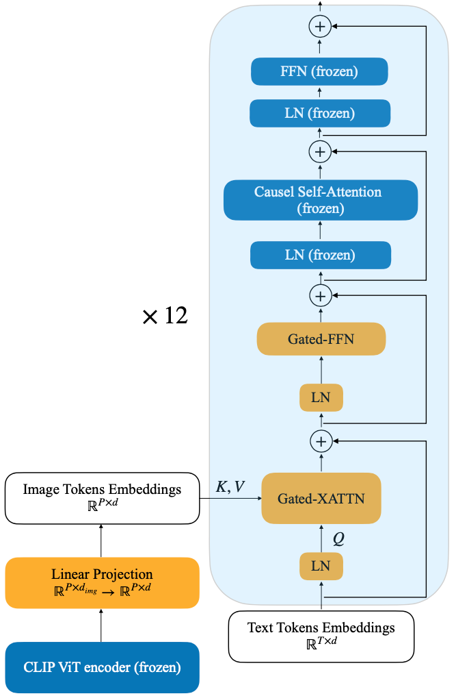
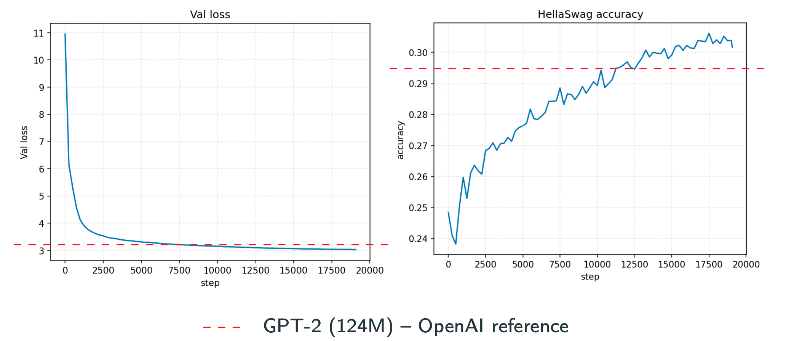
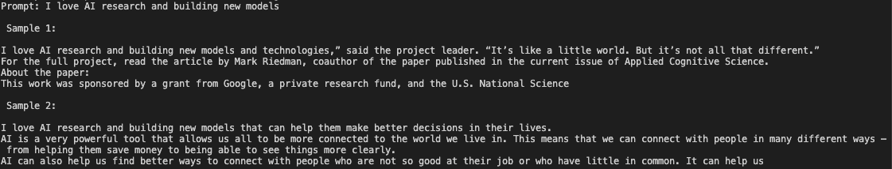
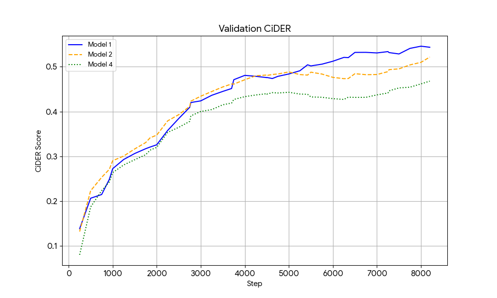
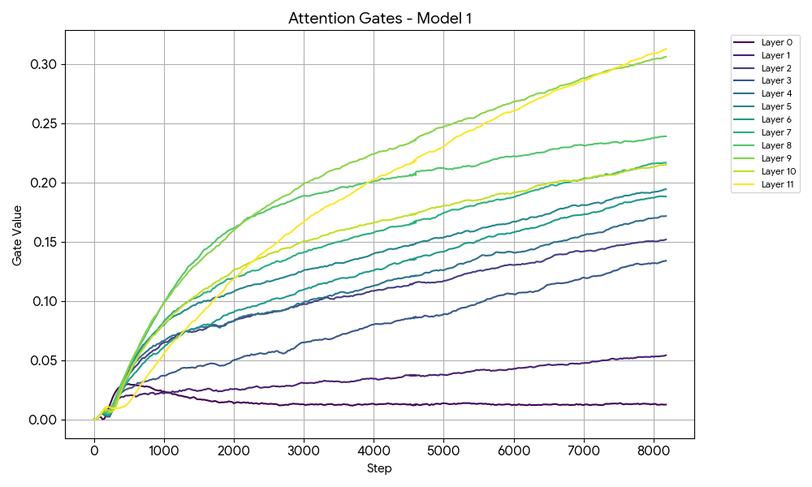
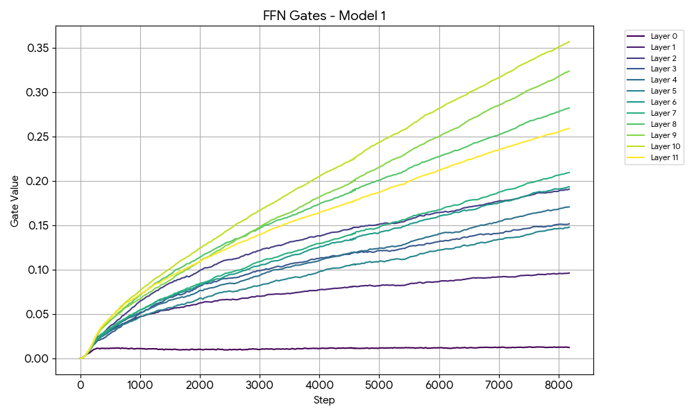
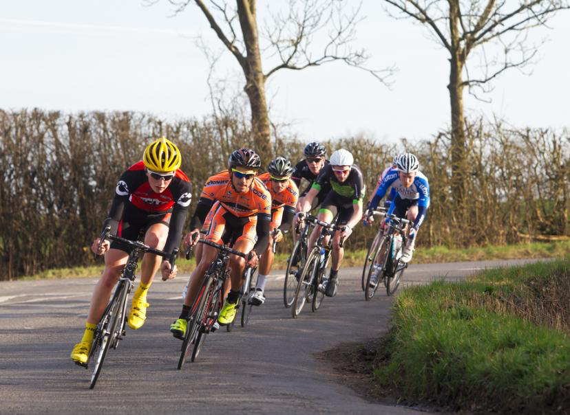
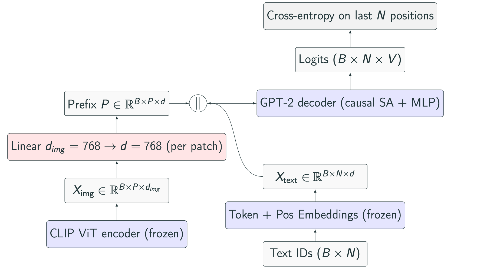
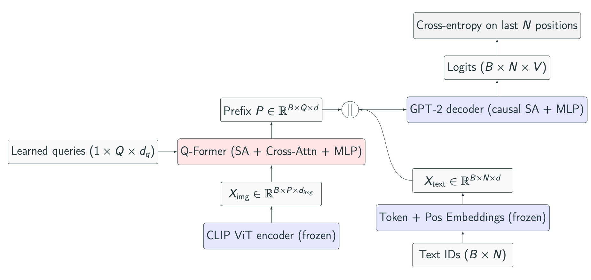

# Pretraining and Multimodal Fine-Tuning of a LLM
## Image Captioning with GPT-2

Independent project conducted alongside my Master 2 in AI at PSL Research University.  
A vision-language pipeline combining a frozen CLIP vision encoder with a GPT-2 decoder augmented by cross-attention, fine-tuned to generate image captions on COCO.

---

## Architecture

- Vision Encoder: CLIP ViT-B/32 (frozen), features projected to 768-d.
- Text Decoder: GPT-2 (12 layers, 12 heads, 768-d), with cross-attention blocks inserted every N layers.
- Fusion: Gated cross-attention integrates image features into decoding.

  

<small><em>Encoder-Decoder with Gated Cross Attention.</em></small>

---

## Training Strategy
### GPT-2 Pretraining
The GPT-2 model was pretrained on the **FineWeb-Edu 10BT** dataset, consisting of 10 billion tokens of high-quality educational web text. The pretraining process followed the methodology outlined in Andrej Karpathy's **"From Zero to Hero"** video series, which demonstrates how to train a GPT-like model from scratch.

#### Key Details:
- **Dataset**: FineWeb-Edu 10BT (sharded and tokenized).
- **Batch Size**: 524,288 tokens (gradient accumulation over 64 steps with micro-batches of size 8).
- **Learning Rate**: 6e-4 with 715-step warmup and cosine decay.
- **Precision**: Mixed precision (bfloat16) for faster training.
- **Validation**: Evaluated on the **HellaSwag** benchmark for natural language understanding.

---

### Fine-Tuning for Image Captioning
The pretrained GPT-2 model was fine-tuned on the **COCO 2017** dataset for image captioning. The vision encoder was frozen, and only the cross-attention and projection layers were trained.

#### Key Details:
- **Dataset**: COCO 2017 (118K training images, 5K validation images).
- **Learning Rate**: Cosine schedule with lr 2e-4 → 1e-4.
- **Precision**: Mixed precision (bfloat16) for faster training.
- **Evaluation**: Perplexity and CIDEr on validation subset with deterministic sampling

---

## Dataset

- **COCO 2017**: 118K training images with 591K captions, 5K validation images with 25K captions.
- **FineWeb-Edu 10BT**: High-quality educational web text for GPT-2 pretraining.

---

## Results

### GPT-2 Pretraining

#### Loss and Accuracy Plots

  

<small><em>Pretraining metrics.</em></small>

  

<small><em>Generated samples from pretrained GPT-2.</em></small>

---
### Fine-Tuning for Image Captioning

#### Evaluation Metrics

<table align="center">
  <tr>
    <td align="center">
       
      <small><em>Validation CIDEr</em></small>
    </td>
    <td align="center">
       
      <small><em>Validation perplexity</em></small>
    </td>
  </tr>
</table>

*Models 1, 2 and 4 correspond to decoders with gated cross-attention every 1, 2 and 4 layers, respectively.*

<table>
  <thead>
    <tr>
      <th style="padding:6px 12px; text-align:left;">Model</th>
      <th style="padding:6px 12px; text-align:left;">Trainable</th>
      <th style="padding:6px 12px; text-align:right;">CIDEr ↑</th>
      <th style="padding:6px 12px; text-align:right;">PPL ↓</th>
    </tr>
  </thead>
  <tbody>
    <tr>
      <td style="padding:6px 12px;">XATTN Every layer</td>
      <td style="padding:6px 12px;">85M (28%)</td>
      <td style="padding:6px 12px; text-align:right;"><strong>57.1</strong></td>
      <td style="padding:6px 12px; text-align:right;"><strong>7.43</strong></td>
    </tr>
    <tr>
      <td style="padding:6px 12px;">XATTN Every 2 layers</td>
      <td style="padding:6px 12px;">43M (17%)</td>
      <td style="padding:6px 12px; text-align:right;">55.9</td>
      <td style="padding:6px 12px; text-align:right;">7.98</td>
    </tr>
    <tr>
      <td style="padding:6px 12px;">XATTN Every 4 layers</td>
      <td style="padding:6px 12px;">21M (9%)</td>
      <td style="padding:6px 12px; text-align:right;">47.8</td>
      <td style="padding:6px 12px; text-align:right;">8.47</td>
    </tr>
  </tbody>
</table>

*Evaluation results after 8 epochs of training.*

#### Analysis of the gates

<table align="center">
  <tr>
    <td align="center">
       
      <small><em>XATTN gates through training</em></small>
    </td>
    <td align="center">
       
      <small><em>FFN gates through training</em></small>
    </td>
  </tr>
</table>

*We observe the same behaviour as in the Flamingo paper: deeper layers have larger gate values.*

---

### Sample Captions

| Image | Generated Caption (Temp = 1.0, Topk@10) |
|-------|--------------------|
|  | "A small dog is standing in the grass." |
|     | "A group of people riding bikes down a road." |
|     | "A large group of cars lined up next to each other." |

## Other Approach

I explored additional multimodal fusion paradigms, following inspirations such as BLIP‑2 and Pixtral:

- Early fusion — linear prefix: project ViT tokens to decoder embeddings and prepend as a prefix. Extremely lightweight (~0.6M params) but low capacity; in experiments it quickly saturated (CIDEr ≈ 12).
- Early fusion — Q‑Former (BLIP‑2 inspired): learn a small set of queries that attend to ViT features and produce prefix tokens. More expressive than the linear prefix; current results: CIDEr 35.0, PPL 12.8.

<table align="center">
  <tr>
    <td align="center">
       
      <small><em>Linear Projection for decoder prefix</em></small>
    </td>
    <td align="center">
       
      <small><em>Q‑Former approach</em></small>
    </td>
  </tr>
</table>

## Bibliography

- Brown, T. B., et al. (2020). Language Models are Few‑Shot Learners. [arXiv:2005.14165](https://arxiv.org/abs/2005.14165)  
- Dao, T., et al. (2022). FlashAttention: Fast and Memory‑Efficient Exact Attention. [arXiv:2205.14135](https://arxiv.org/abs/2205.14135) — FlashAttention  
- Zellers, R., et al. (2019). HellaSwag: Can a Machine Really Finish Your Sentence? [arXiv:1905.07830](https://arxiv.org/abs/1905.07830)  
- Radford, A., et al. (2021). Learning Transferable Visual Models From Natural Language Supervision (CLIP). [arXiv:2103.00020](https://arxiv.org/abs/2103.00020)  
- Alayrac, J.-B., et al. (2022). Flamingo: a Visual Language Model for Few‑Shot Learning. [arXiv:2204.14198](https://arxiv.org/abs/2204.14198) — Flamingo  
- Vedantam, R., Zitnick, C. L., & Parikh, D. (2015). CIDEr: Consensus‑based Image Description Evaluation. [arXiv:1411.5726](https://arxiv.org/abs/1411.5726)  
- Li, J., et al. (2023). BLIP‑2: Bootstrapping Language‑Image Pre‑training with Frozen Image Encoders and Large Language Models. [arXiv:2301.12597](https://arxiv.org/abs/2301.12597) — BLIP‑2 / Q‑Former  
- Agrawal, P., et al. (2024). Pixtral 12B. [arXiv:2410.07073](https://arxiv.org/abs/2410.07073) — Pixtral

---

