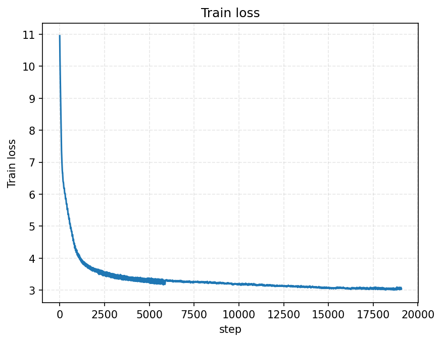
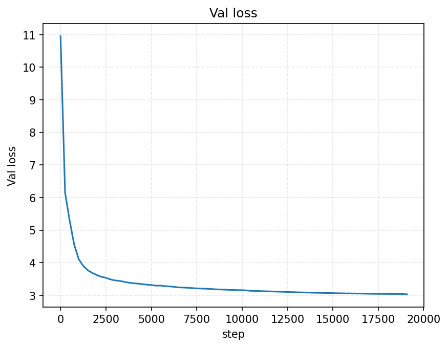
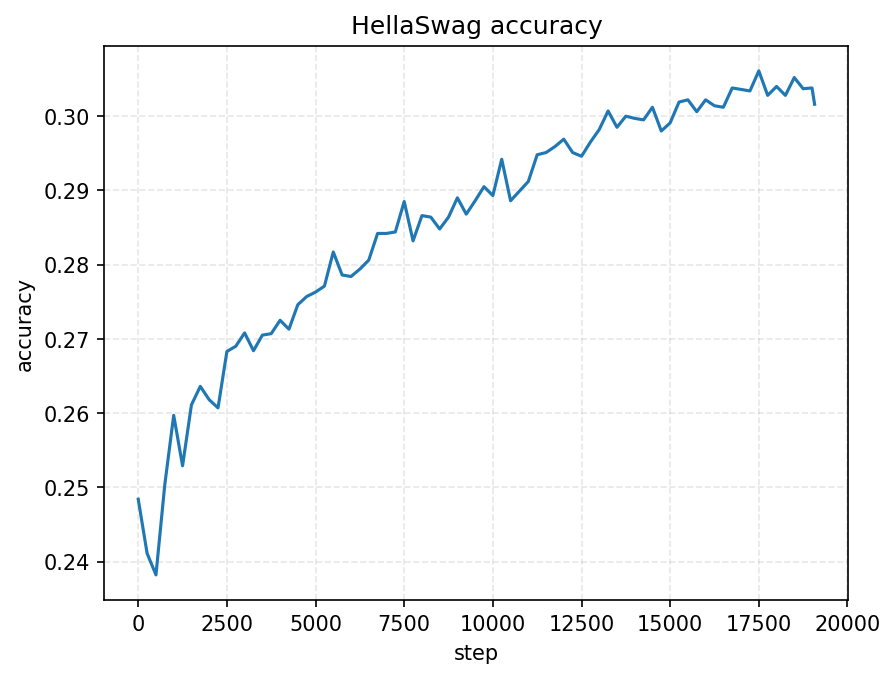
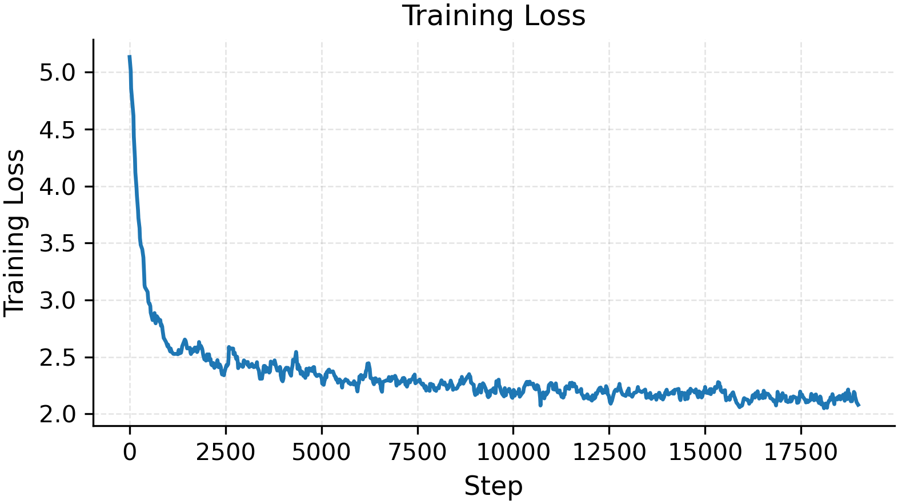
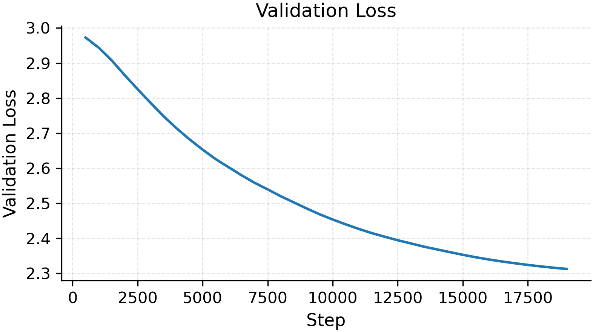
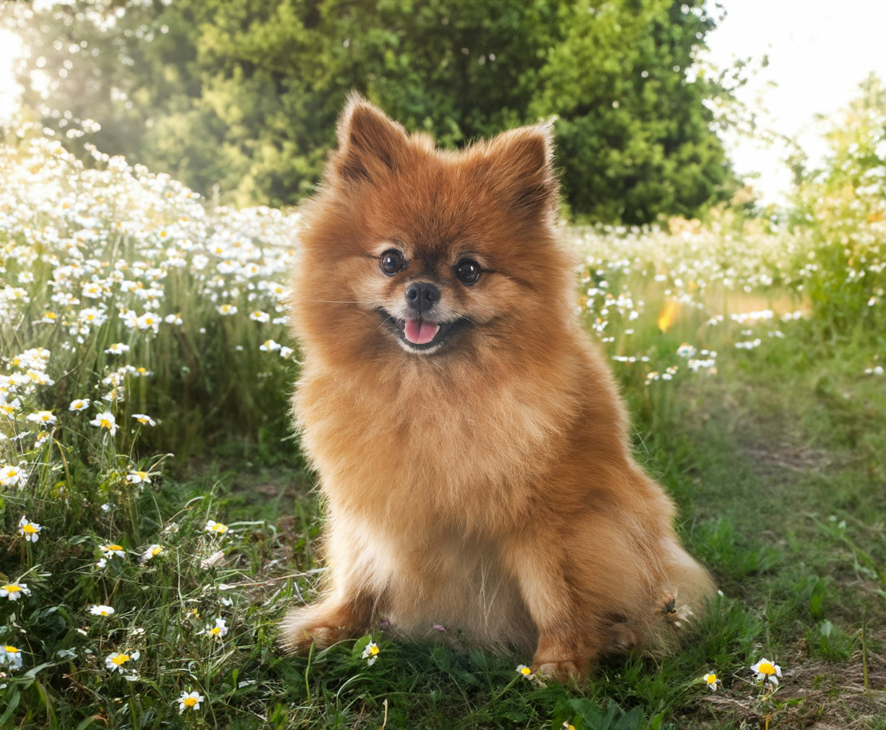

# Image Captioning with GPT-2

A vision-language model that combines a frozen CLIP vision encoder with a GPT-2 decoder enhanced with cross-attention layers to generate image captions.

---

## Architecture

- **Vision Encoder**: Frozen CLIP ViT-B/32 extracts visual features and projects them to 768-dimensional embeddings.
- **Text Decoder**: GPT-2 (12 layers, 768-dim, 12 heads) with cross-attention layers inserted every 2 blocks to integrate visual context.
- **Fusion**: Cross-attention allows the text decoder to attend to image features during caption generation.

---

## Training Strategy

### GPT-2 Pretraining
The GPT-2 model was pretrained on the **FineWeb-Edu 10BT** dataset, consisting of 10 billion tokens of high-quality educational web text. The pretraining process followed the methodology outlined in Andrej Karpathy's **"From Zero to Hero"** video series, which demonstrates how to train a GPT-like model from scratch.

#### Key Details:
- **Dataset**: FineWeb-Edu 10BT (sharded and tokenized).
- **Batch Size**: 524,288 tokens (gradient accumulation over 64 steps with micro-batches of size 8).
- **Learning Rate**: 6e-4 with 715-step warmup and cosine decay.
- **Precision**: Mixed precision (bfloat16) for faster training.
- **Validation**: Evaluated on the **HellaSwag** benchmark for natural language understanding.
---

### Fine-Tuning for Image Captioning
The pretrained GPT-2 model was fine-tuned on the **COCO 2017** dataset for image captioning. The vision encoder (CLIP) was frozen, and only the cross-attention and projection layers were trained.

#### Key Details:
- **Dataset**: COCO 2017 (118K training images, 5K validation images).
- **Batch Size**: 32 images.
- **Learning Rate**: 1e-4 with 500-step warmup and cosine decay.
- **Precision**: Mixed precision (bfloat16) for faster training.
- **Optimization**: Gradient accumulation to simulate larger batch sizes.

---

## Dataset

- **COCO 2017**: 118K training images with 591K captions, 5K validation images with 25K captions.
- **FineWeb-Edu 10BT**: High-quality educational web text for GPT-2 pretraining.

---

## Results

### GPT-2 Pretraining

#### Loss and Accuracy Plots

    <figure style="text-align: center;">
        
    </figure>
    <figure style="text-align: center;">
        
    </figure>
        <figure style="text-align: center;">
        
    </figure>

---

### Fine-Tuning for Image Captioning

#### Loss Plots

    <figure style="text-align: center;">
        
    </figure>
    <figure style="text-align: center;">
             
    </figure>

---

### Sample Captions

| Image | Generated Caption |
|-------|--------------------|
|  | "A small dog is standing in the grass." |
|     | "A group of people riding bikes down a road." |

---

